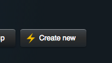
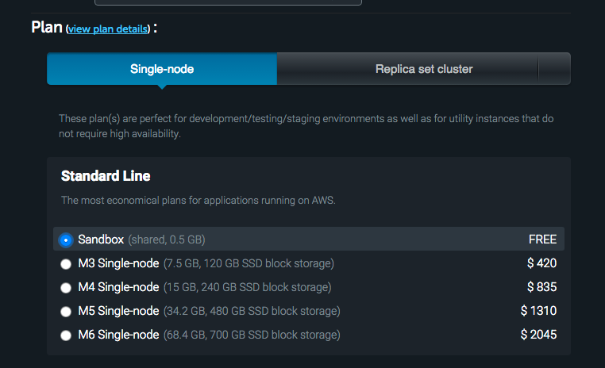
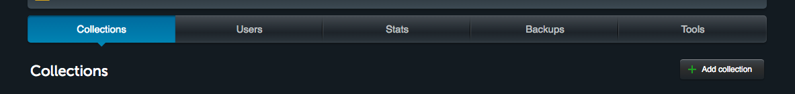
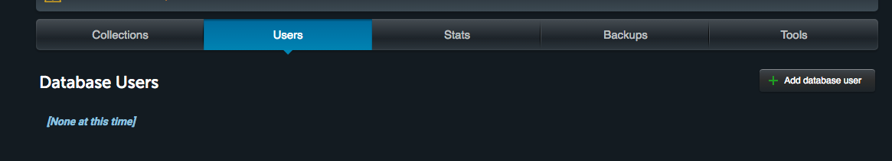
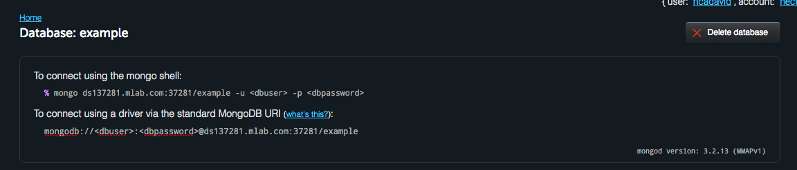

## Ejemplo de uso del cliente Java para MongoDB

Para usar el ejemplo se recomienda crear una base de datos, y en ésta una colección de documentos, en la verisón gratuita de mLab:

1. Cree una cuenta en mLab: https://mlab.com/
2. Una vez registrado, agregue un nuevo despliegue de base de datos. Escoga la configuración 'Sandbox', que es gratuita:

	
	
	
3. Abra la base de datos creada, y cree en ésta una nueva colección:

	

4. Para poder acceder a la colección desde una base de datos, debe crear un usario asociado a la base de datos:

	

5. Una vez hecha esta configuración, la URL de conexión para los clientes se mostrará en la misma interfaz:

	

6. Una vez hecho esto, puede probar el cliente de ejemplo dado en los fuentes, simplemente cambiando la URL, el usuario y la contraseña en la conexión. 

Para consultas más avanzadas, puede consultar la [documentación oficial de MongoDB](http://mongodb.github.io/mongo-java-driver/2.13/getting-started/quick-tour/), u [otro material de referencia como el publicado en el sitio mkyong](https://www.mkyong.com/mongodb/java-mongodb-query-document/
).

